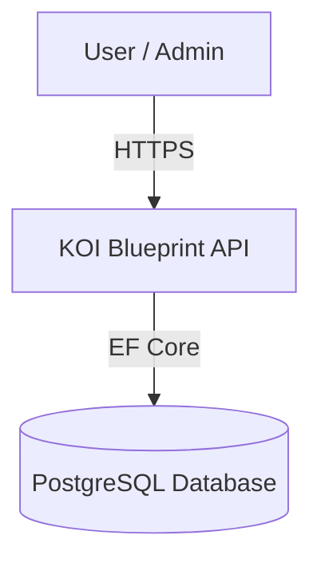
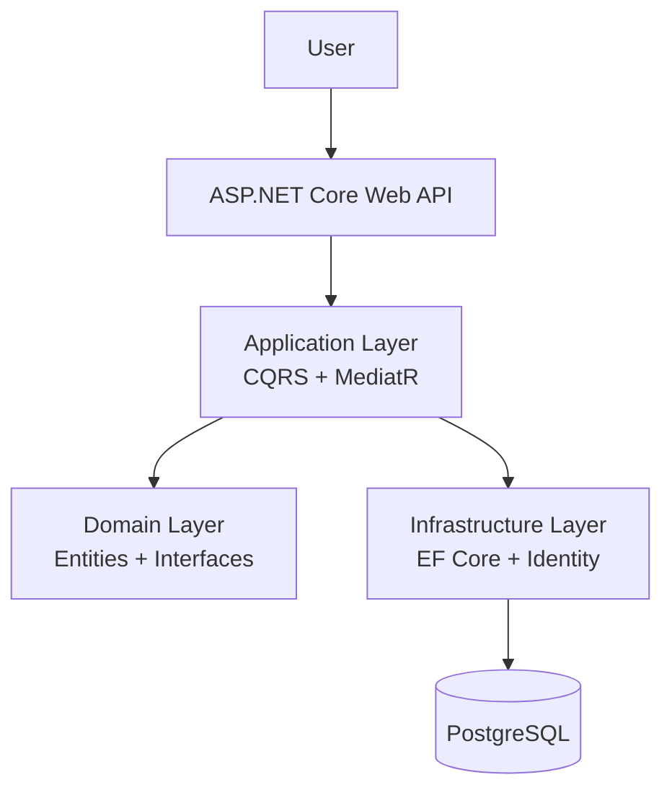
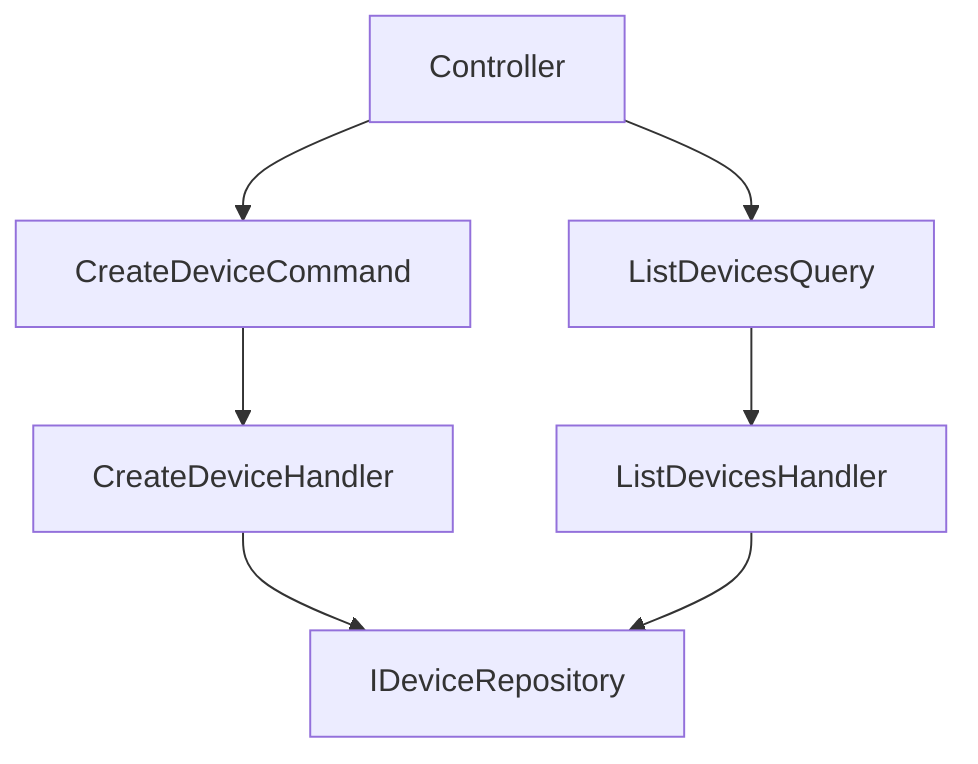
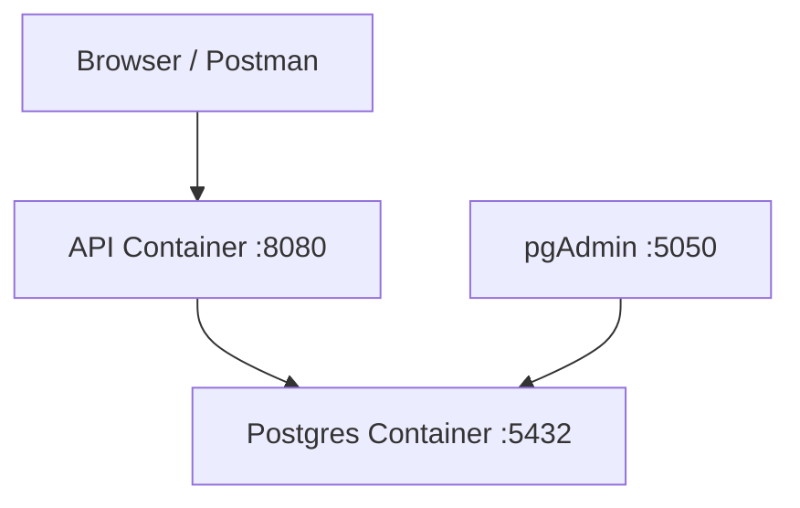

# KOI Blueprint API

Enterprise-ready backend system built with **.NET 8**, applying:

- Clean Architecture  
- Domain-Driven Design (DDD)  
- CQRS with MediatR  
- Repository Pattern + Unit of Work  
- ASP.NET Core Identity  
- EF Core + PostgreSQL  
- Docker & docker-compose  

---

# 🚀 Architecture Overview

The project follows **Clean Architecture** principles with strict dependency rules.

```
API Layer
   ↓
Application Layer (CQRS, Handlers, Validators)
   ↓
Domain Layer (Entities, Interfaces, Business Rules)
   ↓
Infrastructure Layer (EF Core, Identity, Repositories)
   ↓
PostgreSQL
```

## Core Architectural Patterns

### 1️⃣ Clean Architecture

- Domain layer is framework-independent
- Application layer implements use cases
- Infrastructure contains persistence logic
- API is only the composition root

Dependency rule:  
> Infrastructure depends on Domain. Domain depends on nothing.

---

### 2️⃣ Domain-Driven Design (DDD)

Applied DDD-lite approach:

- Entities represent core business concepts (Device, User)
- Aggregate Root pattern (Device as aggregate)
- Repository interfaces defined in Domain layer
- Business rules protected inside entities

Example:

```csharp
public interface IDeviceRepository
{
    Task AddAsync(Device device, CancellationToken ct);
    Task<IReadOnlyList<Device>> ListAllAsync(CancellationToken ct);
}
```

---

### 3️⃣ CQRS with MediatR

Separation of:

- Commands (Write)
- Queries (Read)

Example flow:

```
Controller → MediatR → Handler → Repository → DbContext
```

Benefits:

- Clear use-case structure
- Thin controllers
- Better scalability
- Easier unit testing

---

### 4️⃣ Repository Pattern + Unit of Work

- Repository encapsulates data access
- DbContext acts as Unit of Work
- Transaction boundaries are controlled centrally

Example:

```csharp
public interface IUnitOfWork
{
    Task<bool> SaveEntitiesAsync(CancellationToken ct = default);
}
```

---

# 🗄 Database

- PostgreSQL
- Schema: `bk`
- EF Core Code-First
- Migration-based schema management

---

# Identity

Using ASP.NET Core Identity with:

- Custom User entity
- Custom Role entity
- UserRole join entity
- Seed initial roles and users

---

# 🐳 Docker Setup

Services:

- API (.NET 8)
- PostgreSQL
- pgAdmin

---

# 🛠 Getting Started

This project is based on **.NET 8**.

## Prerequisites

- .NET 8 SDK
- Docker Desktop
- PostgreSQL (if running without Docker)
- Visual Studio 2022 (17.8+) or VS Code

## Clone Repository

```bash
git clone https://github.com/linhnguyenhp88/bluesprint-dotnet8-postgresql.git
cd bluesprint-dotnet8-postgresql
```

---

# Running with Docker 

⚠ Ensure Docker Desktop is running.

## Build & Start Services

```bash
docker compose up -d --build
```

Services:

- API → http://localhost:8080  
- Swagger → http://localhost:8080/swagger  
- pgAdmin → http://localhost:5050  

---

## Database Connection Inside Docker

```
Host=postgres;
Port=5432;
Database=koservice;
Username=pgadmin;
Password=Admin123!;
```

---


## Start PostgreSQL manually

Make sure PostgreSQL is running on:

```
localhost:5432
```

## Update Connection String

```json
"ConnectionStrings": {
  "DefaultConnection": "Host=localhost;Port=5432;Database=koservice;Username=pgadmin;Password=Admin123!"
}
```

## Run Migration

```bash
dotnet ef migrations add InitialSchema
dotnet ef database update
```

## Run Application

```bash
dotnet run --project src/KOI.Blueprint.API/KOI.Blueprint.API.csproj
```

Swagger:

```
http://localhost:5000/swagger
```

---

# 🔧 Development Notes

## DateTime Strategy

PostgreSQL `timestamp with time zone` expects UTC.

Always use:

```csharp
DateTimeOffset.UtcNow
```

## When Running API Inside Docker

```
Host=postgres
```

## When Running API Outside Docker

```
Host=localhost
```

---

# Testing (Recommended)

Suggested stack:

- xUnit
- FluentAssertions
- Moq

Test:

- Command Handlers
- Query Handlers
- Domain logic
- Validators

---

# Future Improvements

- JWT Authentication
- Role-based authorization policies
- Redis caching
- Outbox pattern
- OpenTelemetry tracing
- Kubernetes deployment

---

# 📌 Key Design Decisions

| Concern | Solution |
|----------|----------|
| Business Logic | Domain Layer |
| Use Cases | Application Layer (CQRS) |
| Data Access | Repository Pattern |
| Transactions | Unit of Work (DbContext) |
| Authentication | ASP.NET Core Identity |
| Deployment | Docker + docker-compose |

---

# Architecture Diagram

## System Context



---

## Container Diagram



---

## Component Diagram (Application Layer)



---

## Deployment Diagram (Docker)


